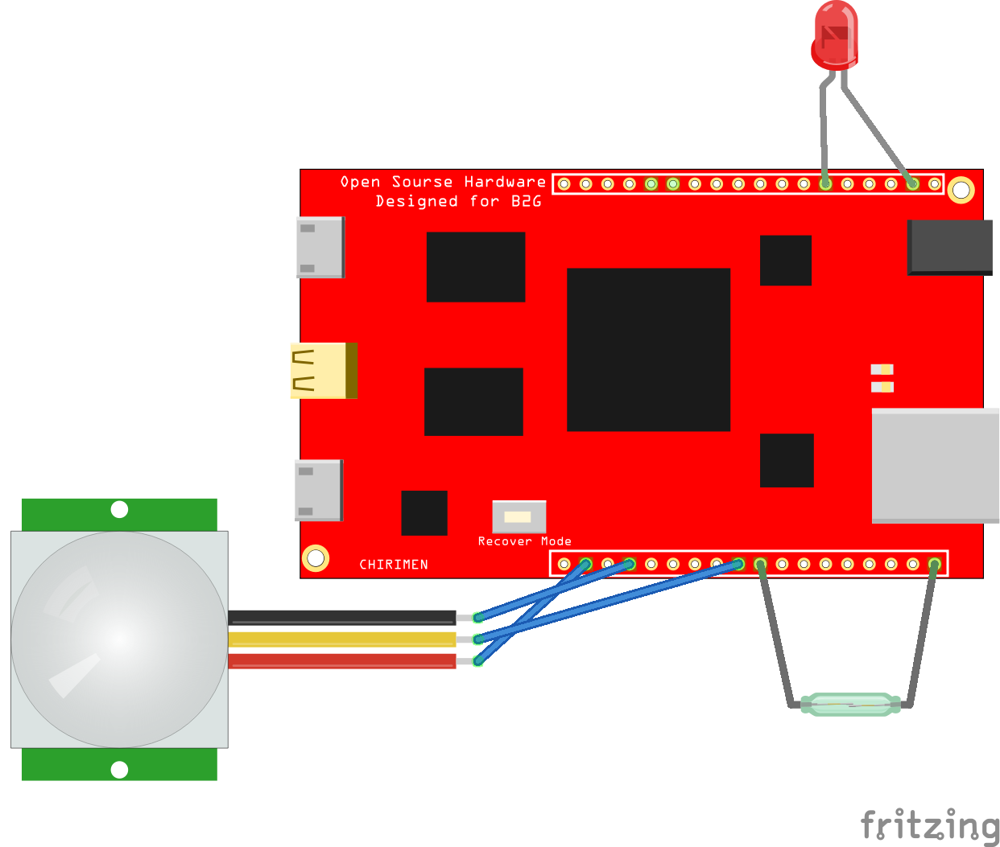

# \<polymerchirimen\>

## Requirements

- Node.js (recommend latest version)
- [CHIRIMEN Open Hardware](https://chirimen.org/)
- Firefox (recommend latest version)
- npm
- bower

## Install dependencies

```sh
$ npm install
$ bower install
```

## Install to CHIRIMEN

- Connect CHIRIMEN to your computer
- Open Web IDE on Firefox
- Install this application

more details, please see [tutorial](http://www.openbookproject.net/tutorials/fxos/episode03.html) to using for Web IDE.

## Demo Movie

https://twitter.com/sizuhiko/status/891199012493119488

## Circuit Diagram


